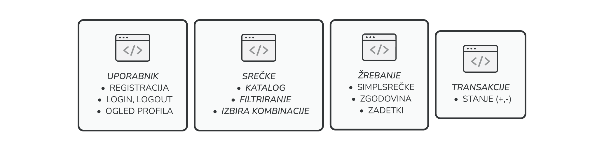

# SimplSrecka

## Mikrostoritev:User

### Funkcionalnosti te mikrostoritve:
* Prijava uporabnika
* Registracija uporabnika
* Posodabljanje uporabnika
* Pridobivanje podatkov uporabnika


|   |   |
|--|--|
|__Naziv Projekta__| SimplSrečka |
|__Člani Skupine__| Brecelj Luka, Kržan Ariana |
|__Opis Projekta__| Razvili bomo spletno loterijo SimplSrečka, ki bo ponujala svojo srečko z istim imenom. Poleg te bo mogoče kupiti tudi druge srečke kot so Eurojackpot in Loto. Aplikacija bo ponujala vplačilo srečk, ogled rezultatov žrebanj in upravljanje s svojim stanjem. |
|__Razvojno ogrodje__| Java, Docker, Kubernetes |

## Funkcionalnosti
* Registracija
* Prijava
* Odjava
* Ogled kataloga srečk
* Izbira kombinacije
* Vplačilo kombinacije
* Ogled vseh svojih vplačanih kombinacij
* Ogled preteklih rezultatov žrebanj za vse kategorije srečk
* Žrebanje SimplSrečke
* Ogled stanja na računu
* Polnjenje stanja
* Dvig stanja

## Arhitektura
 

## Use Case
* Nakup srečke
* Polnjenje sranja
* Dvig stanja
* Filtriranje srečk glede na velikost dobitka
* Ogled svojih zadetkov


# ZA ZAGON IN TESTIRANJE

## Prerequisites

```bash
docker run -d --name pg-lottery-ticket -e POSTGRES_USER=dbuser -e POSTGRES_PASSWORD=postgres -e POSTGRES_DB=lottery-ticket -p 5432:5432 postgres:13
```

## Build and run commands
```bash
mvn clean package
cd api/target
java -jar image-catalog-api-1.0.0-SNAPSHOT.jar
```


